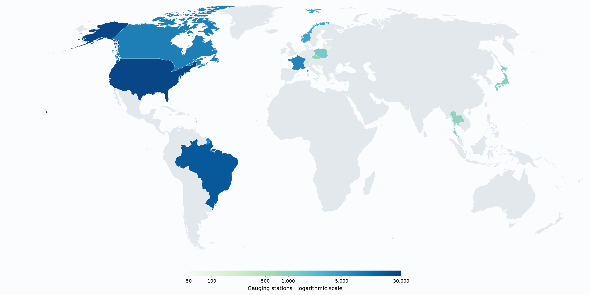

# RivRetrieve

RivRetrieve is an open-source Python package for finding and downloading river observations
(discharge, stage and water temperature) directly from national and regional agencies around
the world, through one consistent interface. RivRetrieve also ships a searchable
catalogue of gauging stations, harmonises identifiers, units and columns across agencies, and
records the source of every retrieval, so that results can be traced back to the original
provider. The vision of RivRetrieve is to become a community platform for the world's
openly published river data, one that grows as new agencies are added.

## River data and where to find them

From floods to droughts: understanding and modelling rivers is a central environmental concern. For that, we need data. Preferably open data. Many countries measure their rivers at thousands of stations, but compiling that information is often hard. Different data portals, different languages, different formats. All of that adds up quickly for anyone interested in the data. The data exist, but accessing them is challenging.

RivRetrieve helps close this gap. It lets you find gauges, choose the physical observations you need, and retrieve them
without learning a different Python interface for each agency. The map below shows countries where
providers are already implemented and countries where data are coming soon. Currently, RivRetrieve retrieves observations
from thirteen different providers in twelve countries.



*Boundaries: [Natural Earth](https://www.naturalearthdata.com/). Their depiction implies no position on territorial status.*

RivRetrieve focuses on time series of discharge, stage and water temperature.
It leaves source quality judgements and study suitability to the reader. Think of RivRetrieve as
a bridge between the original provider and the user.

Some providers require credentials. See the [usage guide](docs/usage.md#supplied-credentials)
for how to supply them.

<details>
<summary>Providers and access</summary>

| Country | Agency | Provider | Stations | Access |
|---|---|---|---:|---|
| Bosnia and Herzegovina | Agencija za vodno područje rijeke Save (AVP Sava) | `ba_fhmzbih` | 60 | Open |
| Brazil | Agência Nacional de Águas e Saneamento Básico (ANA) | `br_ana` | 17,914 | Credentials required |
| Canada | Environment and Climate Change Canada (ECCC) | `ca_eccc` | 8,057 | Bulk download |
| Czechia | Czech Hydrometeorological Institute (CHMI) | `cz_chmi` | 831 | Open |
| France | Hub'Eau | `fr_hubeau` | 7,347 | Open |
| France | HydroPortail | `fr_hydroportail` | 6,409 | Open |
| Japan | Ministry of Land, Infrastructure, Transport and Tourism (MLIT) | `jp_mlit` | 1,023 | Open |
| Lithuania | Lithuanian Hydrometeorological Service (LHMT) | `lt_lhmt` | 97 | Open |
| Norway | Norwegian Water Resources and Energy Directorate (NVE) | `no_nve` | 3,804 | Credentials required |
| Poland | Institute of Meteorology and Water Management (IMGW) | `pl_imgw` | 1,301 | Bulk download |
| Switzerland | Federal Office for the Environment (FOEN) | `ch_foen` | 246 | Open |
| Thailand | Hydro-Informatics Institute (HII), ThaiWater | `th_thaiwater` | 825 | Open |
| United States | U.S. Geological Survey (USGS) | `usgs_nwis` | 26,201 | Open |

Station counts show gauges with supported series in the packaged catalogues, not guaranteed current data availability.
The USGS catalogue retains 26,258 station identities; 26,201 have selectable modern series in this snapshot.
A station can appear under both French services; their series remain separate.

</details>

<details>
<summary>Countries coming soon</summary>

Afghanistan, Argentina, Australia, Belgium, Chile, Colombia, Denmark, Estonia, Finland, Germany,
Greece, Ireland, Israel, Italy, Mexico, Netherlands, New Zealand, Peru, Portugal, Slovenia,
Somalia, South Africa, South Korea, Spain, Sweden, Taiwan, Türkiye and the United Kingdom.

Some of these have a fetcher in the legacy
[RivRetrieve-Python](https://github.com/kratzert/RivRetrieve-Python) that awaits porting; others
come from our survey of national services. Sources differ in what they publish, so a country can
arrive with a single agency or a single region first. The map shows whole countries either way.

</details>

Know a data source we’re missing? Suggest it in a
[GitHub issue](https://github.com/RivRetrieve/RivRetrieve/issues), with source links and relevant
access information.

## Install

Requires Python 3.13 or later. We recommend [uv](https://docs.astral.sh/uv/):

```bash
uv add rivretrieve
```

It also installs with pip: `pip install rivretrieve`.

For optional station maps, install the `map` extra: `uv add "rivretrieve[map]"`.

## Quick start

The packaged catalogue contains station locations and known source-series facts.
Searching it does not contact the agencies. The following example then contacts USGS to retrieve
one day of daily mean streamflow, without credentials.

```python
import rivretrieve as rr

# Find daily mean streamflow and choose a gauge.
daily_gauges = rr.find(
    provider="usgs_nwis", quantity="discharge", frequency="daily", statistic="mean"
)

chosen_gauges = rr.pick(daily_gauges, station=["07374000"])

result = rr.fetch(chosen_gauges, start="2023-01-01", end="2023-01-01")

# Inspect two columns as a short list of rows.
print(result.data.select("station_id", "value").rows())

# Output:
# [('07374000', 10562.183778816001)]

print(result.issues)

# Output:
# ()
```

The displayed values come from a recorded USGS response. Live source responses can change.
The empty tuple means this retrieval reported no issues.

`result.data` is a Polars table of observations. Use `rr.series(result)` to inspect the returned
source series and their outcomes.
Discharge values use m³/s. Read timestamps together with their zone column. Inspect `result.issues`
even when rows come back. A successful call does not establish continuous records or scientific
comparability. Downloading observations requires internet access.

### When an agency publishes different versions for the same variable

Brazil's ANA publishes Bruto (raw) and Consistido (quality-checked) daily records.
ANA performs that checking, not RivRetrieve. Both are available. You choose whether to request
both or just one. You can inspect and select them without credentials or network access:

```python
brazil = rr.find(
    provider="br_ana", station="15400000", quantity="stage", frequency="daily", statistic="mean"
)

print(sorted(rr.series(brazil)["variant"].to_list()))

# Output:
# ['bruto', 'consistido']

consistido = rr.pick(brazil, variant="consistido")

print(rr.series(consistido)["variant"].to_list())

# Output:
# ['consistido']
```

Fetching `brazil` requests both daily mean water-level series by default. Fetching `consistido`
requests only the quality-checked series. Not every period has observations for both.
The [usage guide](docs/usage.md#when-an-agency-publishes-more-than-one-version) shows the downloads
and explains how to supply ANA credentials.

Next: the [usage guide](docs/usage.md) builds on the same example and covers selections, time windows,
issues, credentials and caching. The [CAMELS-US example](docs/examples/camels-us.md) retrieves
streamflow for several gauges at once.

## What RivRetrieve does and does not do

- **Choose the observations you need.** Search for discharge or narrow to daily means. A source
  appears in a daily-mean search only when its values are known to be daily means. Two matching
  records can still differ in ways that matter for your study.
- **No quality control or gap filling.** RivRetrieve does not assess scientific quality.
  It converts units and formats, and reports retrieval and parsing issues. Provider-specific
  observation quality flags are not added to harmonised output.
- **No aggregation.** RivRetrieve does not aggregate data (e.g., from hourly to daily). Data are
  returned at the time step the provider publishes: daily data are available only where the
  provider already publishes daily values.
- **No hosting.** RivRetrieve does not host or redistribute the data. Downloads come from the providers' own
  services.
- **Fresh downloads depend on the providers.** Service outages or changes can prevent new
  downloads. Previously cached observations can remain available.

## Documentation

Start with the [documentation index](docs/README.md).

- [Usage](docs/usage.md): selections, results, windows, issues, credentials, cache and receipts.
- [Example: Recent streamflow for CAMELS-US gauges](docs/examples/camels-us.md).
- [Public API and software reference](docs/reference.md).
- [Architecture](docs/architecture.md): responsibilities, a traced request and contracts.

## Data rights

All data rights remain with the original providers. Credit the providers of data you use and
follow their attribution and citation requirements. Users are responsible for reviewing and
following each provider's terms, which can be found on their respective homepages. The MIT licence
in the LICENSE file applies only to the code of this package, not to any data downloaded through
it.

## Background

RivRetrieve is under active development. Breaking changes should be expected between release
versions. See the [issues](https://github.com/RivRetrieve/RivRetrieve/issues) for what is being
worked on.

The package began as a Python translation of
[RivRetrieve for R](https://github.com/Ryan-Riggs/RivRetrieve) by Ryan Riggs, made by @kratzert with
the Gemini CLI and a few manual fixes for API changes. It has grown into a collaborative effort
since, with @simonmoulds, @thiagovmdon and @CooperBigFoot.

Questions, bug reports and collaboration are welcome through the
[issues](https://github.com/RivRetrieve/RivRetrieve/issues).

## Acknowledgements

Importantly, this project would not exist without the open APIs of so many data providers. We thank
them for their data and for supporting the philosophy of open data.

We also thank Henning Plessow at the Global Runoff Data Centre (GRDC) for the exchanges leading
up to RivRetrieve’s first release. Their R package
[hydrodownloadR](https://github.com/bafg-bund/hydrodownloadR) offers related access to station
catalogues and daily time series from public national and regional APIs.
