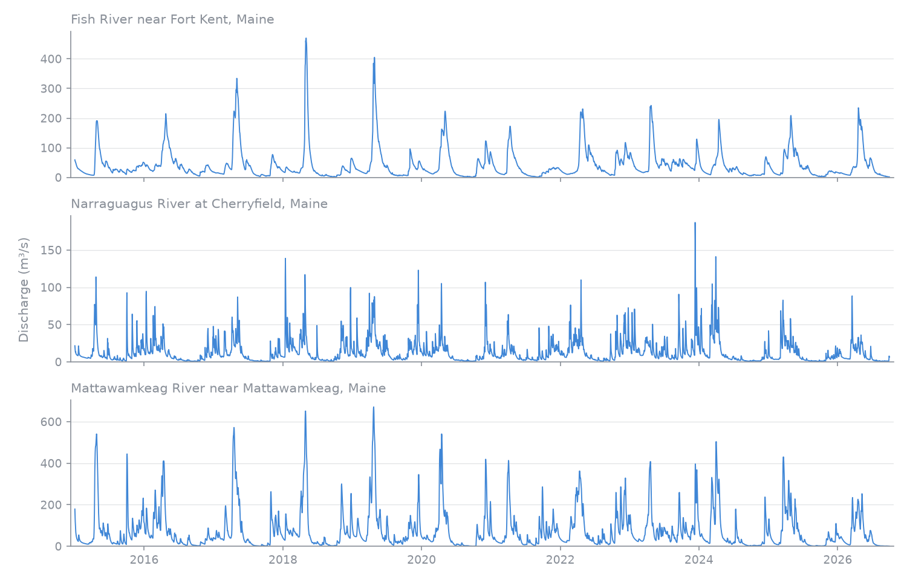

# Daily streamflow for CAMELS-US gauges, 2015 to 2026

[Documentation index](../README.md) · [Usage](../usage.md)

The CAMELS-US version 1.2 record lists time-series coverage through 31 December
2014. USGS publishes the same gauges' daily discharge up to the present, so you can
pick up where CAMELS stops. This example downloads daily discharge from 1 January
2015 to 30 September 2026 for three CAMELS gauges in Maine and plots it.

The identifiers and names come from the
[CAMELS gauge list](https://zenodo.org/records/15529996/files/camels_name.txt).

| Station ID | Name in CAMELS |
|---|---|
| `01013500` | Fish River near Fort Kent, Maine |
| `01022500` | Narraguagus River at Cherryfield, Maine |
| `01030500` | Mattawamkeag River near Mattawamkeag, Maine |

## Download the data

Install RivRetrieve and matplotlib with `uv add rivretrieve matplotlib`. Run the
Python blocks below in order in the same session. Retrieval needs network access but
no credentials. Keep gauge identifiers as strings so their leading zeros survive.

`find` filters the packaged catalogue, `pick` keeps our three gauges and `fetch`
downloads the days from `start` to `end`, both included. Leave `end` out to get
everything up to the latest day USGS has published.

```python
import rivretrieve as rr

gauges = rr.find(provider="usgs_nwis", quantity="discharge", frequency="daily", statistic="mean")
camels = rr.pick(gauges, station=["01013500", "01022500", "01030500"])
result = rr.fetch(camels, start="2015-01-01", end="2026-09-30")

print(result.issues)
```

Output:

```text
()
```

Each row is one gauge and one day. The last rows:

```python
print(result.data.select("station_id", "time", "value", "unit").tail(3))
```

Output:

```text
shape: (3, 4)
┌────────────┬─────────────────────┬──────────┬──────┐
│ station_id ┆ time                ┆ value    ┆ unit │
│ ---        ┆ ---                 ┆ ---      ┆ ---  │
│ str        ┆ datetime[μs]        ┆ f64      ┆ str  │
╞════════════╪═════════════════════╪══════════╪══════╡
│ 01030500   ┆ 2026-09-28 00:00:00 ┆ 0.778713 ┆ m3/s │
│ 01030500   ┆ 2026-09-29 00:00:00 ┆ 0.818357 ┆ m3/s │
│ 01030500   ┆ 2026-09-30 00:00:00 ┆ 0.767387 ┆ m3/s │
└────────────┴─────────────────────┴──────────┴──────┘
```

USGS publishes these daily means; RivRetrieve does not calculate them from
instantaneous observations. Values are converted from ft³/s to m³/s. Daily labels
are plain calendar dates (`time_zone="unknown"`), so do not treat them as UTC.

## Check what came back

Print the dates before plotting. A gauge that stopped reporting looks the same as
a quiet one on a plot.

```python
import polars as pl

coverage = (
    result.data.group_by("station_id")
    .agg(
        pl.len().alias("days"),
        pl.col("time").min().dt.date().cast(pl.String).alias("first"),
        pl.col("time").max().dt.date().cast(pl.String).alias("last"),
    )
    .sort("station_id")
)
print(coverage.rows())
```

Output:

```text
[('01013500', 4291, '2015-01-01', '2026-09-30'), ('01022500', 4291, '2015-01-01', '2026-09-30'), ('01030500', 4291, '2015-01-01', '2026-09-30')]
```

All three gauges have a value for every day from 2015-01-01 to 2026-09-30. For other
gauges, compare `days` with the number of days between `first` and `last`. Missing
days are not in the USGS record and are not filled in.

## Plot it

```python
import matplotlib.pyplot as plt

names = {
    "01013500": "Fish River near Fort Kent",
    "01022500": "Narraguagus River at Cherryfield",
    "01030500": "Mattawamkeag River near Mattawamkeag",
}

fig, axes = plt.subplots(3, 1, figsize=(10, 6.4), sharex=True)
for ax, (station, name) in zip(axes, names.items()):
    rows = result.data.filter(pl.col("station_id") == station).sort("time")
    ax.plot(rows["time"], rows["value"], lw=0.8)
    ax.set_title(f"{name}, Maine", loc="left", fontsize=10)
    ax.set_ylim(bottom=0)
fig.supylabel("Discharge (m³/s)")
fig.tight_layout()
fig.savefig("camels_daily_discharge.png", dpi=150)
```




The figure above was made with this code (plus some styling, see
`docs/scripts/camels_example_plot.py`) from a request on 5 October 2026.

## Gauge metadata

`rr.metadata` returns one row per gauge: name, coordinates, drainage area and more.
It reads the packaged catalogue, so it works offline and needs no request. These
are the columns you will use most. The wider table cells just keep the full names
on one line.

```python
meta = rr.metadata(camels)

with pl.Config(fmt_str_lengths=60, tbl_width_chars=140):
    print(meta.select("station_id", "station_name", "latitude", "longitude", "drainage_area_value", "drainage_area_unit"))
```

Output:

```text
shape: (3, 6)
┌────────────┬─────────────────────────────────────────────┬───────────┬────────────┬──────────────────────┬────────────────────┐
│ station_id ┆ station_name                                ┆ latitude  ┆ longitude  ┆ drainage_area_value  ┆ drainage_area_unit │
│ ---        ┆ ---                                         ┆ ---       ┆ ---        ┆ ---                  ┆ ---                │
│ str        ┆ str                                         ┆ f64       ┆ f64        ┆ list[str]            ┆ list[str]          │
╞════════════╪═════════════════════════════════════════════╪═══════════╪════════════╪══════════════════════╪════════════════════╡
│ 01013500   ┆ Fish River near Fort Kent, Maine            ┆ 47.2375   ┆ -68.582778 ┆ [""870"", ""870""]   ┆ ["sq mi", "sq mi"] │
│ 01022500   ┆ Narraguagus River at Cherryfield, Maine     ┆ 44.608056 ┆ -67.935278 ┆ [""227"", ""227""]   ┆ ["sq mi", "sq mi"] │
│ 01030500   ┆ Mattawamkeag River near Mattawamkeag, Maine ┆ 45.501111 ┆ -68.305833 ┆ [""1419"", ""1419""] ┆ ["sq mi", "sq mi"] │
└────────────┴─────────────────────────────────────────────┴───────────┴────────────┴──────────────────────┴────────────────────┘
```

Latitude and longitude are in decimal degrees. The drainage area is in square miles,
as USGS publishes it, and is stored as text, which is why it shows in quotes. USGS
lists two area fields for these gauges and they agree. Elevation is also in the
metadata, but USGS describes it as gage or land-surface altitude, so read
[station metadata](../station-metadata.md#interpret-elevations) before using it.

## Use it in your own study

Pass more gauge identifiers to `pick` and change the dates in `fetch`. Check
`result.issues` and the dates per gauge before combining results with CAMELS.
Before putting both on one axis, remember:

- CAMELS and the numbers above both come from USGS, but CAMELS is a frozen
  version. USGS can revise past values, so the two can differ for the same day.
- Recent values are provisional and USGS may revise them (see the
  [provider page](../providers/usgs_nwis.md)).
- Check units and the daily time definition on both sides.

Save the table with `result.data.write_parquet("usgs_daily.parquet")`. To keep the
source definitions, outcomes and provenance with it, use `rr.to_bundle(result)`.
The [usage guide](../usage.md) explains issues, time handling and cache reuse.

## Licence, citation and credit

USGS-produced data are in the
[U.S. Public Domain](https://www.usgs.gov/information-policies-and-instructions/copyrights-and-credits),
so you can plot and share them, figures included. USGS asks for credit; see the
[USGS provider page](../providers/usgs_nwis.md#access-terms-and-citation) for the
wording.

The [CAMELS version 1.2 record](https://zenodo.org/records/15529996) gives separate
citations for the time series and catchment attributes. Cite the parts you use.

For streamflow and forcing time series:

- Newman et al. (2014). *A large-sample watershed-scale hydrometeorological dataset
  for the contiguous USA*. UCAR/NCAR.
  [doi:10.5065/D6MW2F4D](https://doi.org/10.5065/D6MW2F4D)
- Newman et al. (2015). *Development of a large-sample watershed-scale
  hydrometeorological dataset for the contiguous USA: dataset characteristics and
  assessment of regional variability in hydrologic model performance*.
  [doi:10.5194/hess-19-209-2015](https://doi.org/10.5194/hess-19-209-2015)

For catchment attributes:

- Addor et al. (2017). *CAMELS: Catchment Attributes and MEteorology for Large-sample Studies*. UCAR/NCAR.
  [doi:10.5065/D6G73C3Q](https://doi.org/10.5065/D6G73C3Q)
- Addor et al. (2017). *The CAMELS data set: catchment attributes and meteorology
  for large-sample studies*.
  [doi:10.5194/hess-21-5293-2017](https://doi.org/10.5194/hess-21-5293-2017)

The observations retrieved here come from USGS, not from the CAMELS archive.
Cite USGS and RivRetrieve as well.
